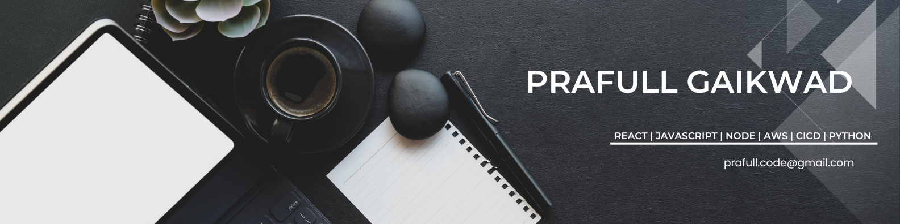

# 🌟 Hi, I'm **Prafullkumar Gaikwad**  

  

### 💻 *Crafting Scalable, User-Centric Digital Solutions with Expertise in JavaScript, React, and Node.js!*  

📧 **[prafull.code@gmail.com](mailto:prafull.code@gmail.com)**  

---

## 🚀 About Me  

👨‍💻 I’m a passionate **Technical Team Leader** and **Solution Architect** with **9+ years** of experience in building cutting-edge **web and mobile applications**.  
🎯 My focus: delivering **scalable**, **high-performance**, and **cloud-native** solutions using **React.js**, **Next.js**, **Node.js**, and **AWS**.  
✨ I thrive in **mentoring teams**, optimizing workflows, and bridging the gap between **business goals** and **technology**.

---

## 🛠️ Tech Stack  

```yaml
Programming Languages: 
  - JavaScript:
      - React.js
      - Next.js
      - Node.js
      - React Native

Frontend Development:
  - HTML5
  - CSS3 (SASS, Tailwind)

Backend & Databases: 
  - Node.js
  - GraphQL
  - MongoDB
  - MySQL

DevOps & Cloud: 
  - AWS (EC2, S3, Lambda, RDS)
  - Docker | Kubernetes
  - CI/CD Pipelines

Testing & QA: 
  - Jest | Cypress | React Testing Library
```

---

## 💼 Experience  

### 💡 **Technical Team Leader** – *Metta Social* (Feb 2023 – Present)  
- 🚀 Spearheaded projects using **React.js**, **Next.js**, and **AWS**, ensuring timely and high-quality deliveries.  
- 🛠️ Architected robust **CI/CD pipelines** and scalable microservices architecture.  
- 🎯 Guided a team of developers, aligning their efforts with business needs.  

---

### 👨‍💻 **Senior Software Engineer** – *NeoSoft Technologies* (Jan 2019 – Feb 2023)  
- 🌐 Delivered modern web apps leveraging **React.js**, **Redux**, and **Next.js**.  
- 🧹 Optimized project workflows with advanced **code reviews** and best practices.  

---

### 📱 **Senior Web App Developer** – *Softerus Pvt Ltd* (Jun 2016 – Dec 2018)  
- ✨ Created mobile apps with **React Native** and scalable PHP APIs.  
- 🔧 Designed robust frontend and backend architectures.  

---

### 🌟 **Freelancer** – *Web Application Developer* (Jun 2015 – May 2016)  
- 🎨 Built responsive, SEO-friendly websites using **Bootstrap** and **PHP**.  
- 🤝 Collaborated with clients to deliver bespoke digital experiences.  

---

## 🎓 Education  

🎓 **Master of Computer Applications (MCA)**, Pune University – 2014  
🎓 **Bachelor of Computer Science (BCS)**, Marathwada University – 2011  

---

## 🌐 Connect with Me  

[](https://www.linkedin.com/in/prafull-gaikwad)  
[](mailto:prafull.code@gmail.com)  


---

## 🌟 Highlights  

- 👨‍🏫 *Mentoring & Leadership*: A proven track record of empowering teams to excel.  
- 🌐 *Open Source Contributions*: Actively contributing to the developer community.  
- 🚀 *Passionate Learner*: Always exploring the latest tech trends and innovations.

---

### ✨ Thanks for stopping by! Let’s build something amazing together.  

